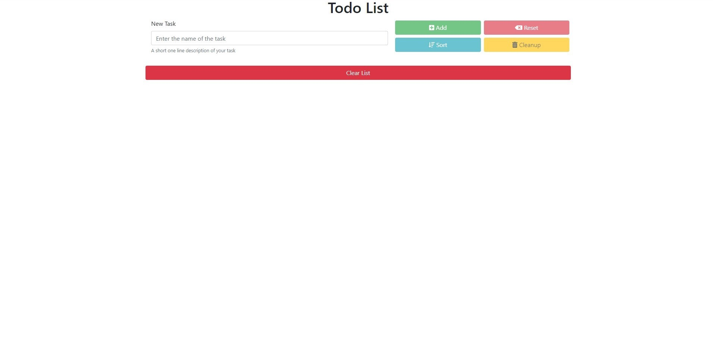
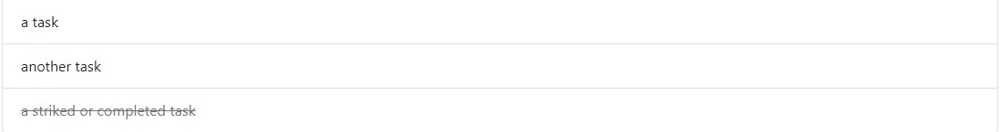

# TODO_List
This is Normal TODO list online created by me. 

## Buttons:

1. You can add a task by describing it the input box and pressing 
   the **Add button** or the **Enter Key**.
2. The **Reset Button** can be used to empty the text box.
3. The **Sort Button** sort the tasks as completed and incomplete.
4. The **Clean Up Button** removes the completed Tasks.
5. The **Clear List** Cleans the whole List.

## Tasks

1. Click the Task once to toggle it or mark it as done.
2. Click again to toogle it again or mark it as not done or incomplete 